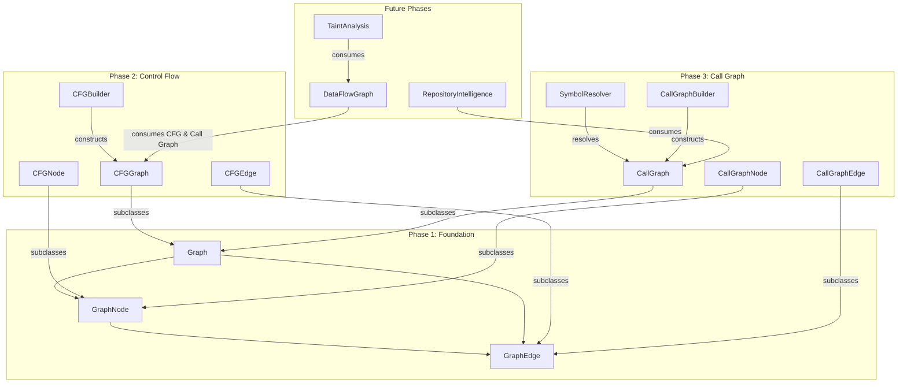

# CodeGuard V2 Architecture: Repository-Level Static Analysis

CodeGuard V2 introduces repository-level analysis, evolving from single-file checks to holistic codebase understanding. This is built on an isolated, extensible Graph infrastructure.

## Graph Architecture Diagram

---

## 1. Shared Graph Foundation (`app/analysis/graph/`)
A generic directed graph implementation designed to serve as the structural backbone for all future graph-based analyses.

- **`graph_types.py`**: Defines base kinds of nodes and edges (e.g. branch, statement, call, normal flow).
- **`graph_node.py`**: Base `GraphNode` class supporting arbitrary dictionary properties for metadata storage.
- **`graph_edge.py`**: Base `GraphEdge` representing directed links.
- **`graph_base.py`**: Adjacency-list based `Graph` class supporting:
  - Depth-First Search (`dfs`)
  - Breadth-First Search (`bfs`)
  - Path Finding (`find_path`)
  - Cycle Detection (`has_cycle`)

---

## 2. Control Flow Graph (`app/analysis/cfg/`)
Represents the deterministic execution flow of a single function or module.

- **`basic_block.py`**: Groups straight-line, branch-free statement sequences (`ast.AST`).
- **`cfg_builder.py`**: Recursively maps function structures (If/Else, Loops, Break/Continue, Returns, Try/Except).
- **`cfg_graph.py`**: Enhances Graph to run static deterministic checks:
  - **Unreachable Code**: Identifies statement blocks with no traversal path from `ENTRY`.
  - **Missing Return Paths**: Finds exit paths in non-void functions lacking explicit `Return`/`Raise`.
  - **Dead Branches**: Identifies branches dominated by constant expressions (e.g., `if False:`).
  - **Excessive Branching**: Computes cyclomatic complexity ($M = E - V + 2$).

---

## 3. Call Graph (`app/analysis/call_graph/`)
Builds a repository-wide model mapping function/method calls to their corresponding definitions.

- **`symbol_resolver.py`**: Indexes definition statements and parses absolute, relative, and aliased imports.
- **`call_graph_builder.py`**: Performs a discovery pass followed by call target resolution to map edges.
- **`call_graph_queries.py`**: Provides API helpers for future query consumers:
  - `get_callers()`: Finds direct callers.
  - `get_callees()`: Finds direct callees.
  - `get_reachable_functions()`: Performs BFS/transitive closure of reachable functions.
  - `get_degree()`: Returns in-degree/out-degree counts.

---

## Future Consumption

Future analysis layers will build on this infrastructure:
1. **Data Flow & SSA**: CFG basic blocks will map variable definitions and usages.
2. **Taint Analysis**: Tracks untrusted user inputs flowing from sources to sinks via the Call Graph and Data Flow Graph.
3. **Repository Intelligence & RAG**: Graph paths will provide context matching rules for precise AI analysis.
